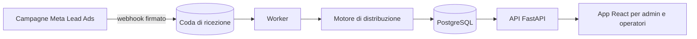

# CRM per call center con smistamento automatico dei lead

> Caso di studio — realizzato su misura per un'azienda italiana di servizi. Nome del cliente omesso per riservatezza.

<!-- TODO screenshot: SOLO dopo aver rifatto le catture con dati finti e senza logo/nome del cliente -->

**Stato:** in produzione · **Ruolo:** analisi, architettura, sviluppo completo, deploy · **Codice:** di proprietà/uso del cliente, non pubblico

> ⚠️ Pubblicabile solo con **autorizzazione scritta del cliente**, anche in forma anonima. Da verificare il contratto.

---

## Il problema
I contatti generati dalle campagne pubblicitarie su Facebook/Instagram venivano smistati a mano tra gli operatori:
distribuzione disomogenea, contatti duplicati, richiami dimenticati, nessun tracciamento degli esiti.

## La soluzione
- I lead arrivano **in automatico** dalle campagne Meta tramite webhook firmato, con coda durevole e idempotente.
- Vengono **distribuiti in modo equo** agli operatori disponibili, rispettando turni e orari, con garanzie transazionali anche sotto carico concorrente.
- **Deduplicazione** su numero di telefono normalizzato.
- Gli operatori registrano chiamate, esiti, note e richiami con scadenza; "prossimo lead" con un clic.
- Interfaccia pensata per l'operatore **da smartphone**.
- Sicurezza e GDPR: ruoli, autenticazione con token ruotati, password con Argon2, rate limiting, anonimizzazione, audit log senza dati personali, export CSV protetto.

## Architettura (semplificata)

## Stack
| Livello | Tecnologie |
|---|---|
| Backend | Python, FastAPI, SQLAlchemy 2, Alembic, PostgreSQL |
| Frontend | React 19, Vite, Tailwind 4, Playwright |
| Sicurezza | JWT con refresh ruotati, Argon2, rate limiting |
| Infrastruttura | Docker Compose, nginx + HTTPS, cloud Linux, backup con ripristino verificato |

## Qualità
Test automatici anche sulla concorrenza su PostgreSQL, migrazioni versionate, dipendenze bloccate e verificate,
documento formale di validazione della consegna.

## Cosa ho fatto io
Tutto il ciclo: requisiti con il cliente, progettazione, sviluppo, test, messa in produzione e supporto.

---
**Contatti:** [gasparepettinati.it](https://gasparepettinati.it) · info@gasparepettinati.it

© 2026 Gaspare Pettinati — Tutti i diritti riservati. Vedi [LICENSE](LICENSE).
