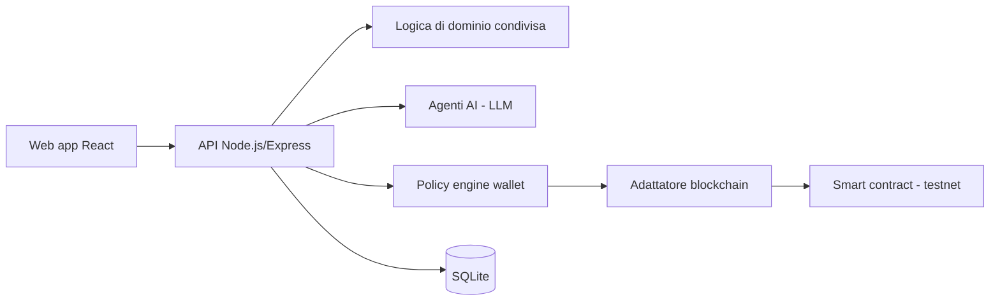

# EnergyToken — Filiera verificabile per l'energia rinnovabile

> Piattaforma che usa agenti AI per trovare e qualificare produttori di energia rinnovabile, verifica i loro dati di produzione e ne registra la tracciabilità su blockchain (rete di test).

<!-- TODO: GIF dal video tutorial docs/tutorial/energytoken-tutorial.mp4 (verificare che non mostri dati commerciali) -->

**Stato:** MVP dimostrativo funzionante · **Ruolo:** architettura e sviluppo completo (web, API, AI, smart contract) · **Codice:** privato

---

## Il problema
Dimostrare in modo affidabile la filiera "produttore → dati verificati → certificato → acquirente" richiede
oggi molti passaggi manuali e dati difficili da controllare.

## La soluzione
- **Agente AI di acquisizione** (LLM): analizza i produttori, assegna un punteggio e prepara bozze di contatto — **mai inviate in automatico**, sempre revisione umana.
- **Motore di verifica**: importa letture di produzione, calcola impronte (hash) e rileva anomalie; un agente AI spiega l'esito all'operatore.
- **Marketplace simulato** con abbinamento domanda/offerta.
- **Wallet dimostrativo con regole di sicurezza**: limiti, approvazione umana prima di ogni operazione.
- **Smart contract** su testnet: registro on-chain e token di tracciabilità (non uno strumento di investimento).
- Dashboard KPI, previsione di produzione a 30 giorni, audit trail completo.

## Architettura (semplificata)

## Stack
| Livello | Tecnologie |
|---|---|
| Linguaggio | TypeScript (monorepo npm workspaces) |
| API | Node.js 22, Express 5, Zod, ethers.js v6, SDK LLM |
| Web | React 19, Vite, Tailwind 4 |
| Blockchain | Solidity 0.8, Hardhat, OpenZeppelin 5, testnet Sepolia |
| Test | node:test, test Hardhat |

## Cosa ho fatto io
Progettazione dell'intero sistema, agenti AI con output strutturato, smart contract, API, interfaccia, modalità demo senza credenziali.

## Demo
Video tutorial di 3 minuti e demo dal vivo su appuntamento.

---
### Perché il codice non è pubblico
Logica di scoring e verifica, prompt degli agenti, regole del wallet e materiale di business sono proprietari.
Codice visibile in **screen-share** o dopo **NDA**.

**Contatti:** [gasparepettinati.it](https://gasparepettinati.it) · info@gasparepettinati.it

© 2026 Gaspare Pettinati — Tutti i diritti riservati. Vedi [LICENSE](LICENSE).
