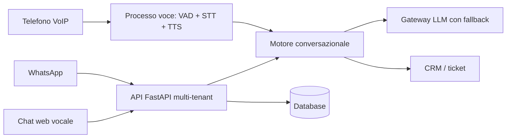

# Leila — Receptionist AI per farmacie (telefono · chat · WhatsApp)

> Assistente digitale che risponde al telefono, in chat e su WhatsApp: orari, disponibilità prodotti, prenotazione servizi, ticket e ricontatto del farmacista quando serve un parere sanitario.

<!-- TODO: screenshot dashboard e pannello superadmin con dati fittizi (mock_data); campioni audio delle voci -->

**Stato:** pilota su server Linux · **Ruolo:** architettura e sviluppo completo · **Codice:** privato

> ⚠️ Prima della pubblicazione: confermare la titolarità del codice (progetto nato per un committente).

---

## Il problema
Il front desk della farmacia passa gran parte del tempo al telefono con domande ripetitive, mentre il bancone aspetta.

## La soluzione
- **Agente telefonico**: risponde alle chiamate VoIP, capisce il parlato e risponde con voce naturale in italiano.
- **Chat web con voce e WhatsApp** (API ufficiale Meta oppure collegamento rapido con QR code).
- Riconosce il cliente dal CRM, compila le prenotazioni passo passo, apre ticket e **passa al farmacista** quando la domanda è sanitaria.
- **Più modelli AI con fallback automatico** (cloud e locali): se un fornitore non risponde, subentra il successivo; in ultima istanza un motore a regole.
- **Piattaforma SaaS multi-farmacia**: organizzazioni, utenti, CRM lead, automazioni, knowledge base, report, misurazione consumi e piani, pannello superadmin.
- Audit delle conversazioni; token cifrati.

## Architettura (semplificata)

## Stack
| Livello | Tecnologie |
|---|---|
| Backend | Python, FastAPI, SQLAlchemy 2, Alembic, JWT |
| Voce | SIP/VoIP, webrtcvad, Whisper / faster-whisper, TTS cloud e locali, SSML |
| AI | Provider multipli (Bedrock, OpenAI, Gemini, Groq, DeepSeek, Ollama) con fallback |
| Canali | WhatsApp Cloud API, gateway QR, web chat con Web Speech API |
| Infrastruttura | Linux, systemd, script di deploy |

## Esempio di codice
`esempio/` — costruttore SSML per stili vocali (modulo generico).

---
### Perché il codice non è pubblico
Prompt, orchestrazione dell'agente, strategia multi-modello e pipeline telefonica sono proprietari.
Demo dal vivo (anche telefonica) su appuntamento; codice in **screen-share** o dopo **NDA**.

**Contatti:** [gasparepettinati.it](https://gasparepettinati.it) · info@gasparepettinati.it

© 2026 Gaspare Pettinati — Tutti i diritti riservati. Vedi [LICENSE](LICENSE).
