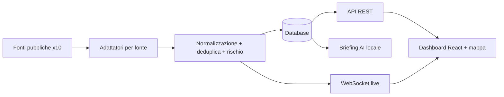

# SENTINEL — Control room OSINT per eventi critici

> Una sola mappa, in tempo reale, per terremoti, catastrofi, meteo estremo, minacce informatiche e crisi umanitarie — costruita solo su fonti pubbliche e senza abbonamenti.

<!-- TODO screenshot: dashboard con mappa, feed live, dettaglio evento (dati pubblici, nessun dato personale) -->

**Stato:** prototipo avanzato funzionante (v1.1) · **Ruolo:** ideazione, architettura, sviluppo full-stack · **Codice:** privato

---

## Il problema
Chi deve monitorare rischi (sicurezza, logistica, protezione civile, assicurazioni) consulta decine di siti diversi,
con formati diversi e notizie duplicate. Ricostruire un quadro chiaro richiede tempo, proprio quando il tempo manca.

## La soluzione
SENTINEL raccoglie in automatico dieci fonti aperte internazionali, unisce le segnalazioni dello stesso evento,
assegna un **punteggio di rischio 0–100** e mostra tutto su una mappa che si aggiorna da sola. Un modello AI
**locale** produce un briefing esecutivo, con un motore a regole di riserva e il vincolo di non inventare dati.

### Funzionalità principali
- 10 connettori a fonti pubbliche (sismologia, catastrofi, meteo, meteo spaziale, vulnerabilità informatiche, crisi umanitarie, notizie globali)
- Mappa interattiva con clustering e filtri per livello di rischio
- Feed live via WebSocket con segnalazione "Breaking"
- Deduplicazione degli eventi per vicinanza geografica, tempo e significato
- Registro di centinaia di webcam pubbliche, con ricerca per vicinanza all'evento
- Briefing AI eseguito in locale (nessun dato inviato a terzi)
- "Source Health Center": stato e latenza di ogni fonte

## Architettura (semplificata)

## Stack
| Livello | Tecnologie |
|---|---|
| Backend | Python 3.11, FastAPI, SQLAlchemy 2 async, APScheduler, httpx |
| Frontend | React 18, TypeScript, Vite, Tailwind, MapLibre GL |
| Dati | SQLite o PostgreSQL |
| AI | LLM locale via Ollama (opzionale) |
| Infrastruttura | Docker Compose, nginx, script di backup/restore/health |

## Cosa ho fatto io
Tutto: analisi delle fonti, progettazione degli adattatori, modello di rischio, backend, frontend, deploy containerizzato.

## Esempio di codice
`esempio/` — un adattatore verso una fonte pubblica e l'interfaccia comune degli adattatori, inclusi solo per mostrare lo stile del codice.
<!-- TODO: copiare providers/base.py e providers/usgs/provider.py DOPO revisione manuale -->

## Demo
Demo dal vivo su appuntamento.

---
### Perché il codice non è pubblico
È un prodotto proprietario: modello di rischio, correlazione degli eventi e motore di briefing restano privati.
Il codice si può vedere in **screen-share** durante un colloquio o dopo un **NDA**.

**Contatti:** [gasparepettinati.it](https://gasparepettinati.it) · info@gasparepettinati.it

© 2026 Gaspare Pettinati — Tutti i diritti riservati. Vedi [LICENSE](LICENSE).
